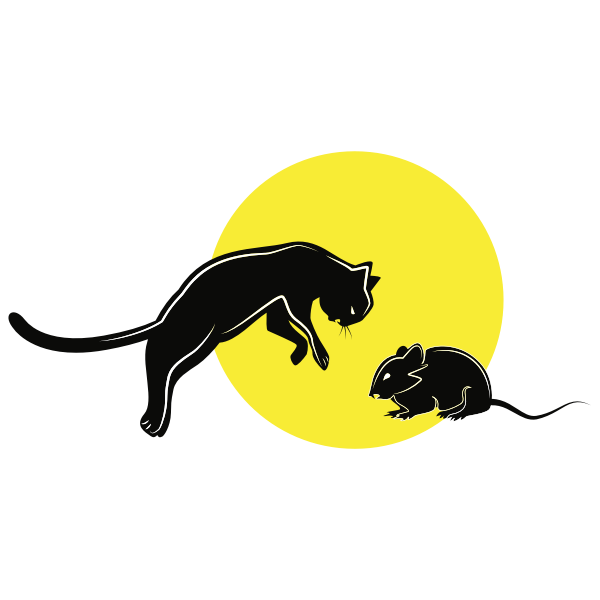

	
	<h3>Cat and Mouse</h3>
	
Created By: Thomas Laurel, Kenny Niles and Favian Flores

## About The Project

For our capstone project, we combined our individual projects (a graphics engine, AI agents, and a networking protocol) to create a game of cat and mouse played by AI agents over a network.

## Getting Started

### Prerequisites

- Python3
- Pygame
- Numpy

### Installation

1. Clone this repo
	> git clone https://github.com/foflores10/CatandMouse.git

### Usage

- Open `cat.py`
- Modify the `LOCALHOST` variable to your local IP address
- Run `python3 mouse.py` in one terminal window
- Run `python3 mat.py` in another terminal window
